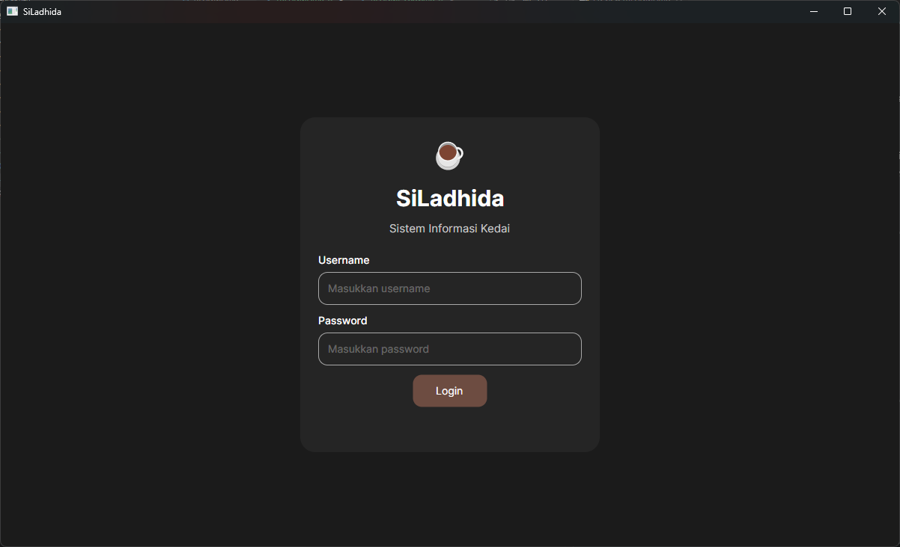
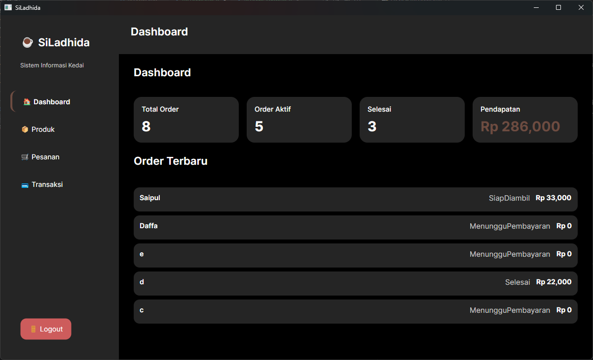
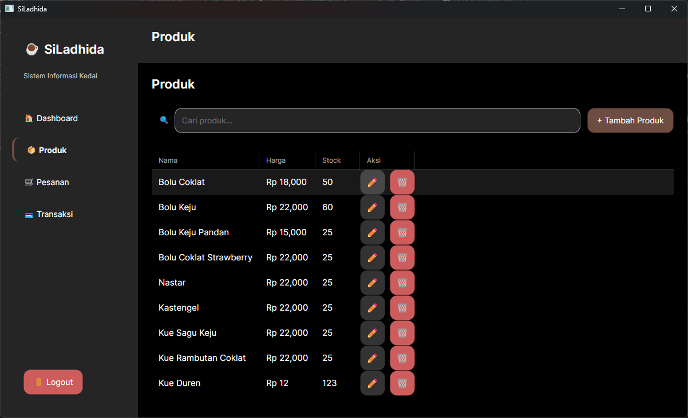
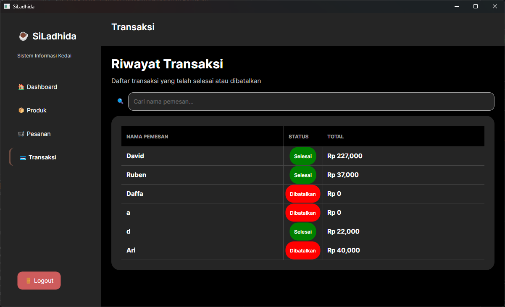

# ☕ SiLadhida — Coffee Shop Management System

> Modern desktop application for managing products, orders, and transactions built with **.NET 8** and **Avalonia UI**, using a clean and scalable layered architecture.

---

## 📸 Preview

| Login | Dashboard |
|-------|-----------|
|  |  |

| Product | Transaction |
|---------|-------------|
|  |  |

---

## 📖 About

SiLadhida is a desktop Point of Sale (POS) application developed to simplify product management, order processing, transactions, and inventory management for small businesses.

Rather than focusing only on CRUD functionality, this project emphasizes **software architecture**, **maintainability**, and **real-world business logic** by applying modern engineering practices such as Layered Architecture, MVVM, REST API, and State Machine.

---

## 🎯 Why This Project?

This project was built to:

* Practice **clean architecture principles**
* Implement **real-world business logic**
* Build a **modern desktop application**
* Improve understanding of **scalable system design**

---

## 🔥 Highlights

* Not just UI — includes **full backend architecture**
* Implements **State Machine for business rules**
* Clean separation between **UI, API, and Domain**
* Reusable and scalable structure

---

## ✨ Features

### Product Management

- Product CRUD
- Category Management
- Stock Management
- Search & Filtering

### Order Management

- Create Order
- Order Detail
- Payment Processing
- State Machine Workflow

### Dashboard

- Sales Summary
- Product Summary
- Transaction Overview

### Transaction

- Transaction History
- Payment Record
- Receipt Generation *(Planned)*

---

## 🛠 Technology Stack

| Category | Technology |
|----------|------------|
| Language | C# |
| Framework | .NET 8 |
| Desktop UI | Avalonia UI |
| Backend | ASP.NET Core Web API |
| Architecture | Layered Architecture |
| Pattern | MVVM |
| Communication | REST API |
| Toolkit | CommunityToolkit.MVVM |

---

## 🏛 Architecture

This project follows a layered architecture to separate presentation, business logic, domain, and infrastructure. The application separates responsibilities into five layers to improve maintainability, scalability, and testability.

```
┌─────────────────────────────┐
│      Avalonia Desktop UI    │
└──────────────┬──────────────┘
               │
               ▼
┌─────────────────────────────┐
│      ASP.NET Core API       │
└──────────────┬──────────────┘
               │
               ▼
┌─────────────────────────────┐
│   Application (Use Cases)   │
└──────────────┬──────────────┘
               │
               ▼
┌─────────────────────────────┐
│      Domain (Core)          │
└──────────────┬──────────────┘
               │
               ▼
┌─────────────────────────────┐
│ Infrastructure (Database)   │
└─────────────────────────────┘
```

---

## 📂 Project Structure

```
SiLadhida
│
├── SiLadhida.App              # Avalonia Desktop UI
├── SiLadhida.API              # ASP.NET Core REST API
├── SiLadhida.Application      # Business Logic & Use Cases
├── SiLadhida.Core             # Domain Models & Contracts
└── SiLadhida.Infrastructure   # Database & External Services
```

---

## 💡 Engineering Practices

This project applies several software engineering concepts:

- Layered Architecture
- MVVM
- Repository Pattern
- Dependency Injection
- REST API
- State Machine
- Separation of Concerns
- SOLID Principles

---

## 🚀 Getting Started

### Prerequisites

- .NET 8 SDK
- Git

### 1. Clone Repository

```bash
git clone https://github.com/Kambing-Gunung/SiLadhida.git
```

### 2. Run Backend API

```bash
cd SiLadhida.API
dotnet run
```

### 3. Run Desktop Application

```bash
cd SiLadhida.App
dotnet run
```

---

## 🗺️ Roadmap

- [x] Dark / Light Theme
- [ ] Dashboard Analytics
- [ ] Export PDF
- [ ] Export Excel
- [ ] Real-time Update
- [ ] Cross-platform Support

---

## 📄 License

This project is developed for educational and portfolio purposes.